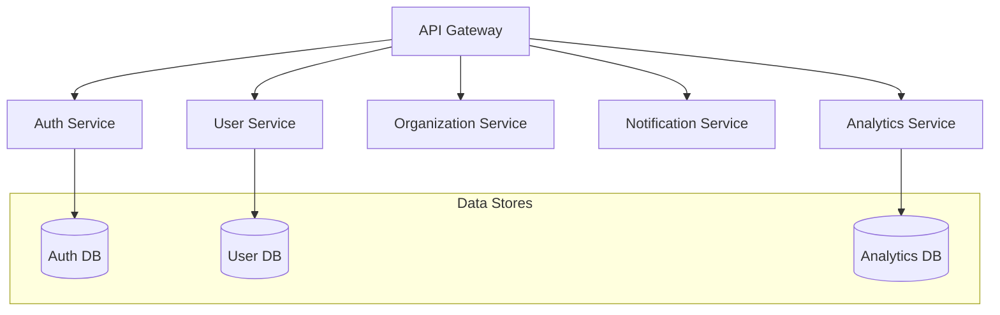

# Advanced Architecture Considerations

## 1. Microservices Breakdown


## 2. Advanced Performance Optimizations

### Database Optimization
```sql
-- Materialized Views for Analytics
CREATE MATERIALIZED VIEW user_activity_summary AS
SELECT 
    user_id,
    COUNT(*) as total_actions,
    COUNT(DISTINCT date_trunc('day', created_at)) as active_days
FROM user_actions
GROUP BY user_id;

-- Partitioning Strategy
CREATE TABLE events (
    id uuid DEFAULT gen_random_uuid(),
    created_at timestamptz NOT NULL,
    event_type text NOT NULL,
    payload jsonb
) PARTITION BY RANGE (created_at);

-- Create Monthly Partitions
CREATE TABLE events_y2024m01 PARTITION OF events
    FOR VALUES FROM ('2024-01-01') TO ('2024-02-01');
```

### Caching Strategy
```typescript
// Multi-level caching
interface CacheConfig {
  memory: {
    max: number;
    ttl: number;
  };
  redis: {
    ttl: number;
    patterns: string[];
  };
  cdn: {
    paths: string[];
    ttl: number;
  };
}

const cacheConfig: CacheConfig = {
  memory: {
    max: 1000,
    ttl: 60 // 1 minute
  },
  redis: {
    ttl: 3600, // 1 hour
    patterns: [
      'user:*',
      'org:*',
      'project:*'
    ]
  },
  cdn: {
    paths: [
      '/api/public/*',
      '/api/static/*'
    ],
    ttl: 86400 // 24 hours
  }
};
```

## 3. Scalability Patterns

### Load Balancing
```typescript
// Load Balancer Configuration
interface LoadBalancerConfig {
  algorithm: 'round-robin' | 'least-connections' | 'ip-hash';
  healthCheck: {
    path: string;
    interval: number;
    timeout: number;
    unhealthyThreshold: number;
  };
  ssl: {
    enabled: boolean;
    cert: string;
    key: string;
  };
}

const loadBalancerConfig: LoadBalancerConfig = {
  algorithm: 'least-connections',
  healthCheck: {
    path: '/health',
    interval: 30,
    timeout: 5,
    unhealthyThreshold: 3
  },
  ssl: {
    enabled: true,
    cert: process.env.SSL_CERT!,
    key: process.env.SSL_KEY!
  }
};
```

### Circuit Breaker Pattern
```typescript
interface CircuitBreakerConfig {
  failureThreshold: number;
  resetTimeout: number;
  monitoredEndpoints: string[];
}

class CircuitBreaker {
  private state: 'CLOSED' | 'OPEN' | 'HALF_OPEN' = 'CLOSED';
  private failures = 0;
  private lastFailureTime?: Date;

  constructor(private config: CircuitBreakerConfig) {}

  async execute<T>(command: () => Promise<T>): Promise<T> {
    if (this.state === 'OPEN') {
      if (this.shouldReset()) {
        this.state = 'HALF_OPEN';
      } else {
        throw new Error('Circuit breaker is OPEN');
      }
    }

    try {
      const result = await command();
      this.onSuccess();
      return result;
    } catch (error) {
      this.onFailure();
      throw error;
    }
  }

  private shouldReset(): boolean {
    if (!this.lastFailureTime) return false;
    return Date.now() - this.lastFailureTime.getTime() > this.config.resetTimeout;
  }
}
```

## 4. Advanced Monitoring

### Metrics Collection
```typescript
interface MetricsCollector {
  // Business Metrics
  trackUserActivity(userId: string, action: string): void;
  trackSubscriptionStatus(orgId: string, status: string): void;
  
  // Technical Metrics
  recordApiLatency(endpoint: string, duration: number): void;
  recordDatabaseQuery(query: string, duration: number): void;
  recordCacheHit(key: string): void;
  recordCacheMiss(key: string): void;
}

// Prometheus Integration
const metrics = new PrometheusMetrics({
  prefix: 'app_',
  defaultLabels: {
    environment: process.env.NODE_ENV
  }
});

// Custom metrics
const httpRequestDuration = metrics.createHistogram({
  name: 'http_request_duration_seconds',
  help: 'Duration of HTTP requests in seconds',
  labelNames: ['method', 'route', 'status_code']
});
```

### Advanced Logging
```typescript
interface LogEntry {
  timestamp: string;
  level: 'debug' | 'info' | 'warn' | 'error';
  context: {
    requestId: string;
    userId?: string;
    orgId?: string;
    environment: string;
    version: string;
  };
  message: string;
  metadata: Record<string, unknown>;
  tags: string[];
  trace?: {
    id: string;
    spanId: string;
    parentId?: string;
  };
}

// Structured logging with correlation
const logger = createLogger({
  format: combine(
    timestamp(),
    correlationId(),
    json()
  ),
  transports: [
    new ElasticsearchTransport({
      level: 'info',
      clientOpts: { node: process.env.ELASTICSEARCH_URL }
    }),
    new CloudWatchTransport({
      level: 'error',
      logGroupName: '/production/api'
    })
  ]
});
```

## 5. Security Enhancements

### API Security
```typescript
// Rate Limiting with Dynamic Thresholds
interface RateLimitConfig {
  basic: {
    points: number;
    duration: number;
  };
  authenticated: {
    points: number;
    duration: number;
  };
  premium: {
    points: number;
    duration: number;
  };
}

// JWT with Refresh Token Rotation
interface TokenPair {
  accessToken: string;
  refreshToken: string;
  expiresIn: number;
}

class TokenManager {
  async rotateRefreshToken(oldRefreshToken: string): Promise<TokenPair> {
    // Validate old refresh token
    // Generate new token pair
    // Invalidate old refresh token
    // Return new pair
  }
}
```

### Data Protection
```typescript
// Field-level Encryption
interface EncryptionConfig {
  algorithm: string;
  keyRotationPeriod: number;
  fields: {
    [table: string]: string[];
  };
}

// Data Masking
const maskingRules = {
  email: (value: string) => value.replace(/(?<=.{3}).(?=.*@)/g, '*'),
  phone: (value: string) => value.replace(/\d(?=\d{4})/g, '*'),
  ssn: (value: string) => `***-**-${value.slice(-4)}`
};
```

## 6. Disaster Recovery

### Backup Strategy
```yaml
# Backup Configuration
backups:
  database:
    full:
      frequency: "0 0 * * *"  # Daily
      retention: 30d
    incremental:
      frequency: "0 */6 * * *"  # Every 6 hours
      retention: 7d
  
  files:
    frequency: "0 0 * * 0"  # Weekly
    retention: 90d
    
  configurations:
    frequency: "0 0 * * *"  # Daily
    retention: 14d
```

### Recovery Procedures
```typescript
interface RecoveryPlan {
  priority: number;
  service: string;
  dependencies: string[];
  estimatedDowntime: number;
  steps: RecoveryStep[];
}

interface RecoveryStep {
  order: number;
  description: string;
  command: string;
  rollback: string;
  validation: () => Promise<boolean>;
}
```

## 7. Development Workflow

### Feature Flags
```typescript
interface FeatureFlag {
  name: string;
  description: string;
  enabled: boolean;
  conditions?: {
    userPercentage?: number;
    userIds?: string[];
    orgIds?: string[];
    environments?: string[];
  };
}

const featureFlags: FeatureFlag[] = [
  {
    name: 'new-dashboard',
    description: 'New dashboard UI',
    enabled: true,
    conditions: {
      userPercentage: 20,
      environments: ['staging', 'production']
    }
  }
];
```

### CI/CD Pipeline
```yaml
# Advanced CI/CD with Canary Deployments
name: Production Deployment
on:
  push:
    branches: [main]

jobs:
  test:
    runs-on: ubuntu-latest
    steps:
      - uses: actions/checkout@v3
      - name: Run Tests
        run: |
          pnpm test
          pnpm test:e2e
          pnpm test:integration

  security:
    runs-on: ubuntu-latest
    steps:
      - name: Security Scan
        uses: snyk/actions/node@master

  deploy-canary:
    needs: [test, security]
    steps:
      - name: Deploy Canary
        run: |
          # Deploy to 10% of production servers
          # Monitor error rates
          # Monitor performance metrics

  deploy-full:
    needs: deploy-canary
    steps:
      - name: Full Deployment
        run: |
          # Deploy to remaining servers
          # Verify deployment
          # Run smoke tests
```

## 8. Performance Testing

### Load Testing Configuration
```typescript
interface LoadTestConfig {
  scenarios: {
    name: string;
    flow: TestStep[];
    users: number;
    rampUpTime: number;
    duration: number;
  }[];
  thresholds: {
    http_req_duration: string;
    http_req_failed: string;
  };
}

const loadTest: LoadTestConfig = {
  scenarios: [
    {
      name: 'API Endpoints',
      flow: [
        { name: 'Home', endpoint: '/' },
        { name: 'Login', endpoint: '/api/auth/login' },
        { name: 'Dashboard', endpoint: '/api/dashboard' }
      ],
      users: 1000,
      rampUpTime: 60,
      duration: 300
    }
  ],
  thresholds: {
    http_req_duration: 'p95<500',
    http_req_failed: 'rate<0.01'
  }
};
```

## 9. Next Steps

1. **Infrastructure Setup**
   - Set up monitoring stack (ELK/Prometheus/Grafana)
   - Configure CI/CD pipelines
   - Set up staging environment

2. **Security Implementation**
   - Implement API security measures
   - Set up audit logging
   - Configure backup systems

3. **Performance Optimization**
   - Implement caching strategy
   - Set up load balancing
   - Configure database optimizations

4. **Development Process**
   - Set up feature flags system
   - Configure automated testing
   - Implement logging system 