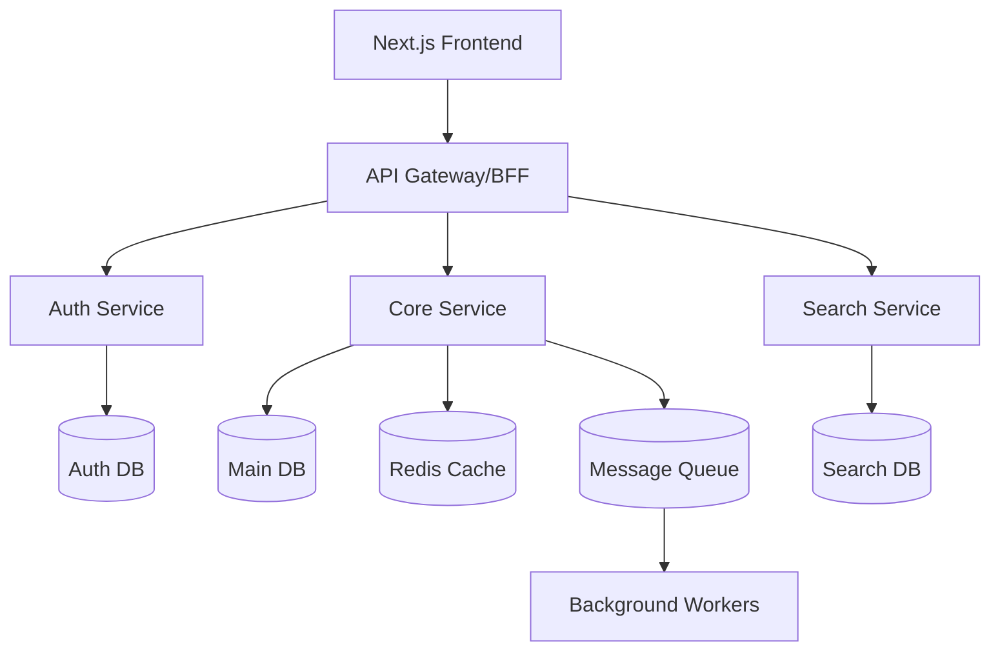

# Backend Architecture & Infrastructure Design

## System Architecture



## 1. Database Architecture

### Primary Database (PostgreSQL)
```sql
-- Key schemas
CREATE SCHEMA auth;
CREATE SCHEMA core;
CREATE SCHEMA analytics;

-- Example core tables
CREATE TABLE core.users (
    id UUID PRIMARY KEY DEFAULT gen_random_uuid(),
    email VARCHAR(255) UNIQUE NOT NULL,
    created_at TIMESTAMPTZ DEFAULT NOW(),
    updated_at TIMESTAMPTZ DEFAULT NOW()
);

CREATE TABLE core.organizations (
    id UUID PRIMARY KEY DEFAULT gen_random_uuid(),
    name VARCHAR(255) NOT NULL,
    subscription_tier VARCHAR(50) NOT NULL,
    created_at TIMESTAMPTZ DEFAULT NOW()
);

CREATE TABLE core.projects (
    id UUID PRIMARY KEY DEFAULT gen_random_uuid(),
    org_id UUID REFERENCES core.organizations(id),
    name VARCHAR(255) NOT NULL,
    created_at TIMESTAMPTZ DEFAULT NOW()
);
```

### Database Strategy
1. **Multi-tenant Architecture**
   - Row-level security (RLS)
   - Tenant isolation
   - Connection pooling (pgBouncer)

2. **Performance**
   - Materialized views for analytics
   - Partitioning for large tables
   - Proper indexing strategy

3. **High Availability**
   - Primary-replica setup
   - Automated failover
   - Regular backups

## 2. Authentication & Authorization

### Auth Stack
1. **Identity Provider**
   - Supabase Auth
   - JWT-based authentication
   - OAuth2.0 providers support

2. **Permission System**
```typescript
// Role-based access control (RBAC)
type Permission = {
  action: 'create' | 'read' | 'update' | 'delete';
  resource: string;
  conditions?: Record<string, any>;
};

type Role = {
  id: string;
  name: string;
  permissions: Permission[];
};

// Usage with organizations
type OrganizationRole = Role & {
  orgId: string;
  scope: 'org' | 'project' | 'team';
};
```

3. **Security Measures**
   - Rate limiting
   - CORS configuration
   - Security headers
   - API key rotation
   - Audit logging

## 3. API Architecture

### API Design
```typescript
// Base API response structure
interface ApiResponse<T> {
  data?: T;
  error?: {
    code: string;
    message: string;
    details?: unknown;
  };
  meta?: {
    page?: number;
    limit?: number;
    total?: number;
  };
}

// API versioning strategy
/api/v1/* // Current stable
/api/v2/* // Beta features
```

### API Implementation
1. **REST API Guidelines**
   - Resource-oriented design
   - Proper HTTP methods usage
   - Consistent error handling
   - Rate limiting per route

2. **GraphQL API (Optional)**
   - Type-safe schema
   - Batched queries
   - Real-time subscriptions

## 4. Infrastructure Setup

### Production Environment
```yaml
# Docker Compose example
version: '3.8'
services:
  api:
    build: ./api
    environment:
      NODE_ENV: production
      DB_URL: ${DB_URL}
    deploy:
      replicas: 3
      
  db:
    image: postgres:15
    volumes:
      - pg_data:/var/lib/postgresql/data
    environment:
      POSTGRES_PASSWORD: ${DB_PASSWORD}

  redis:
    image: redis:7
    volumes:
      - redis_data:/data

  search:
    image: opensearch:latest
    volumes:
      - search_data:/usr/share/opensearch/data

volumes:
  pg_data:
  redis_data:
  search_data:
```

### Scaling Strategy
1. **Horizontal Scaling**
   - Stateless API servers
   - Load balancing
   - Session management in Redis

2. **Caching Strategy**
   - Redis for session/data caching
   - CDN for static assets
   - Query caching

## 5. Background Processing

### Job Queue System
```typescript
// Bull Queue setup
interface JobData {
  userId: string;
  taskType: string;
  payload: Record<string, unknown>;
}

const queue = new Bull<JobData>('processing-queue', {
  redis: process.env.REDIS_URL,
  defaultJobOptions: {
    attempts: 3,
    backoff: {
      type: 'exponential',
      delay: 1000,
    },
  },
});
```

### Scheduled Tasks
1. **Maintenance Tasks**
   - Database cleanup
   - Cache invalidation
   - Analytics aggregation

2. **Business Logic Tasks**
   - Email notifications
   - Report generation
   - Data synchronization

## 6. Monitoring & Observability

### Monitoring Stack
1. **Application Monitoring**
   - Sentry for error tracking
   - DataDog for APM
   - Custom metrics collection

2. **Infrastructure Monitoring**
   - Resource utilization
   - Service health checks
   - Performance metrics

3. **Logging Strategy**
```typescript
// Structured logging
interface LogEntry {
  level: 'info' | 'warn' | 'error';
  message: string;
  timestamp: string;
  traceId: string;
  context: Record<string, unknown>;
}
```

## 7. Development Workflow

### Local Development
```bash
# Development commands
pnpm dev        # Start development server
pnpm test       # Run tests
pnpm migrate    # Run database migrations
pnpm seed       # Seed development data
```

### CI/CD Pipeline
```yaml
# Backend CI/CD
name: Backend CI/CD
on:
  push:
    branches: [main, staging]
  pull_request:
    branches: [main]

jobs:
  test:
    runs-on: ubuntu-latest
    steps:
      - uses: actions/checkout@v3
      - uses: pnpm/action-setup@v2
      - run: pnpm install
      - run: pnpm test
      - run: pnpm lint
      
  deploy:
    needs: test
    if: github.ref == 'refs/heads/main'
    runs-on: ubuntu-latest
    steps:
      - uses: actions/checkout@v3
      - name: Deploy to production
        run: |
          # Deploy steps here
```

## 8. Security Measures

### Security Implementation
1. **API Security**
   - Request validation (Zod)
   - Input sanitization
   - SQL injection prevention
   - XSS protection

2. **Data Security**
   - Encryption at rest
   - Secure data transmission
   - Regular security audits

## 9. Performance Optimization

### Database Optimization
1. **Query Optimization**
   - Proper indexing
   - Query analysis
   - Connection pooling

2. **Caching Strategy**
   - Multi-level caching
   - Cache invalidation
   - Cache warming

## 10. Immediate Implementation Plan

1. **Week 1-2: Foundation**
   - Set up base infrastructure
   - Implement authentication
   - Create core database schema

2. **Week 3-4: Core Features**
   - Implement API endpoints
   - Set up background jobs
   - Add monitoring

3. **Week 5-6: Optimization**
   - Performance tuning
   - Security hardening
   - Documentation

4. **Week 7-8: Testing & Launch**
   - Load testing
   - Security audit
   - Gradual rollout 