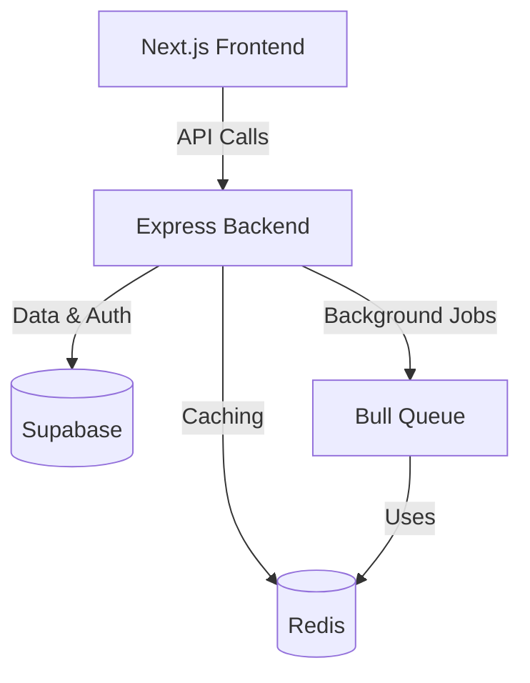
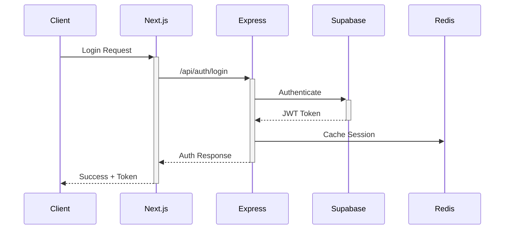
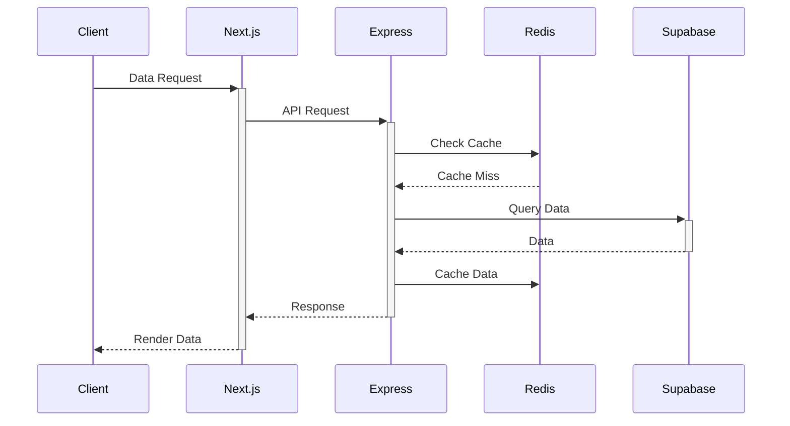

# Technical Stack & Dependencies Flow

## System Architecture Flow


## 1. Frontend Stack
### Next.js (v14+)
- TypeScript
- Tailwind CSS
- Shadcn/ui components
- React Query for data fetching
- Zustand for state management
- React Hook Form for forms

**Key Dependencies:**
```json
{
  "dependencies": {
    "next": "^14.0.0",
    "react": "^18.0.0",
    "react-dom": "^18.0.0",
    "@tanstack/react-query": "^5.0.0",
    "zustand": "^4.0.0",
    "react-hook-form": "^7.0.0",
    "@hookform/resolvers": "^3.0.0",
    "zod": "^3.0.0",
    "tailwindcss": "^3.0.0",
    "@radix-ui/react": "^1.0.0"
  }
}
```

## 2. Backend Stack
### Express.js Server
- TypeScript
- Express.js
- Zod for validation
- Winston for logging
- Cors for security
- Helmet for headers

**Key Dependencies:**
```json
{
  "dependencies": {
    "express": "^4.18.0",
    "typescript": "^5.0.0",
    "@types/express": "^4.17.0",
    "zod": "^3.0.0",
    "winston": "^3.0.0",
    "cors": "^2.8.0",
    "helmet": "^7.0.0",
    "dotenv": "^16.0.0"
  }
}
```

### Supabase Integration
- PostgreSQL database
- Row Level Security (RLS)
- Auth
- Storage
- Real-time subscriptions

**Key Features:**
```typescript
// Supabase client setup
import { createClient } from '@supabase/supabase-js'

const supabase = createClient(
  process.env.SUPABASE_URL!,
  process.env.SUPABASE_ANON_KEY!
)
```

### Redis Stack
- Caching
- Session storage
- Rate limiting
- Job queues

**Key Dependencies:**
```json
{
  "dependencies": {
    "ioredis": "^5.0.0",
    "rate-limiter-flexible": "^3.0.0",
    "bull": "^4.0.0",
    "@types/bull": "^4.10.0"
  }
}
```

## 3. Development Tools
### Code Quality
- ESLint
- Prettier
- Husky
- Commitlint

```json
{
  "devDependencies": {
    "eslint": "^8.0.0",
    "prettier": "^3.0.0",
    "husky": "^8.0.0",
    "@commitlint/cli": "^17.0.0",
    "@commitlint/config-conventional": "^17.0.0"
  }
}
```

### Testing Stack
- Jest
- Supertest
- React Testing Library
- Cypress

```json
{
  "devDependencies": {
    "jest": "^29.0.0",
    "@types/jest": "^29.0.0",
    "supertest": "^6.0.0",
    "@testing-library/react": "^14.0.0",
    "cypress": "^13.0.0"
  }
}
```

## 4. Data Flow Architecture

### Authentication Flow


### Data Request Flow


## 5. Development Environment Requirements

### Required Tools
- Node.js (v18+)
- pnpm (v8+)
- Docker & Docker Compose
- Git
- VS Code (recommended)

### VS Code Extensions
- ESLint
- Prettier
- Docker
- GitLens
- REST Client

### Environment Variables Structure
```bash
# Frontend (.env.local)
NEXT_PUBLIC_API_URL=http://localhost:3000
NEXT_PUBLIC_SUPABASE_URL=your-supabase-url
NEXT_PUBLIC_SUPABASE_ANON_KEY=your-anon-key

# Backend (.env)
PORT=3000
SUPABASE_URL=your-supabase-url
SUPABASE_SERVICE_KEY=your-service-key
REDIS_URL=redis://localhost:6379
NODE_ENV=development
```

## 6. Communication Protocols

### API Standards
- REST API (primary)
- WebSocket (real-time features)
- Server-Sent Events (notifications)

### Security Measures
- CORS configuration
- Rate limiting
- JWT validation
- Input sanitization
- XSS protection

## 7. Deployment Architecture

### Development
- Local Docker environment
- Supabase local development
- Redis local instance

### Production
- Vercel (Frontend)
- Railway/Fly.io (Backend)
- Supabase (Database/Auth)
- Upstash (Redis)
- GitHub Actions (CI/CD)

## Questions to Answer Before Development:

1. **Frontend**
   - Do we need SSR for all pages?
   - Which pages need real-time updates?
   - Mobile-first or desktop-first design?

2. **Backend**
   - Expected request volume?
   - Caching strategy preferences?
   - Rate limiting thresholds?

3. **Database**
   - Expected data volume?
   - Backup strategy?
   - Data retention policy?

4. **Authentication**
   - Required OAuth providers?
   - Session duration?
   - Password policies?

5. **Infrastructure**
   - Expected user load?
   - Geographic distribution?
   - Budget constraints? 