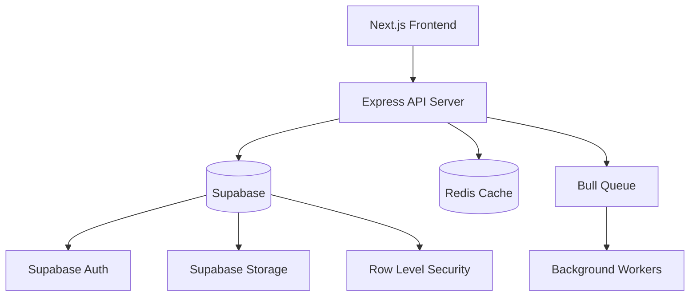

# SaaS Architecture with Express & Supabase

## System Overview



## 1. Express Backend Structure

```typescript
src/
├── api/
│   ├── routes/
│   │   ├── auth.routes.ts
│   │   ├── organizations.routes.ts
│   │   ├── projects.routes.ts
│   │   └── users.routes.ts
│   ├── middlewares/
│   │   ├── auth.middleware.ts
│   │   ├── rateLimit.middleware.ts
│   │   └── validation.middleware.ts
│   └── controllers/
│       ├── auth.controller.ts
│       ├── organizations.controller.ts
│       └── projects.controller.ts
├── services/
│   ├── supabase.service.ts
│   ├── cache.service.ts
│   └── queue.service.ts
├── types/
│   └── index.ts
└── utils/
    ├── logger.ts
    └── errors.ts
```

## 2. Supabase Database Schema

```sql
-- Enable RLS
alter table public.users enable row level security;
alter table public.organizations enable row level security;
alter table public.projects enable row level security;

-- Core Tables
create table public.users (
  id uuid references auth.users primary key,
  email text unique,
  full_name text,
  avatar_url text,
  created_at timestamptz default now(),
  updated_at timestamptz default now()
);

create table public.organizations (
  id uuid default gen_random_uuid() primary key,
  name text not null,
  slug text unique not null,
  plan_id text references public.subscription_plans(id),
  owner_id uuid references public.users(id),
  created_at timestamptz default now()
);

create table public.projects (
  id uuid default gen_random_uuid() primary key,
  name text not null,
  organization_id uuid references public.organizations(id),
  created_at timestamptz default now(),
  updated_at timestamptz default now()
);

-- Subscription Management
create table public.subscription_plans (
  id text primary key,
  name text not null,
  price numeric not null,
  features jsonb default '{}'::jsonb
);

-- RLS Policies
create policy "Users can read own data"
  on public.users
  for select
  using (auth.uid() = id);

create policy "Organization members can access org data"
  on public.organizations
  for all
  using (
    auth.uid() in (
      select user_id from public.organization_members
      where organization_id = id
    )
  );
```

## 3. Express API Implementation

```typescript
// src/api/controllers/organizations.controller.ts
import { supabase } from '../services/supabase.service';
import { redis } from '../services/cache.service';

export class OrganizationsController {
  async create(req: Request, res: Response) {
    const { name, slug } = req.body;
    const userId = req.user.id;

    const { data, error } = await supabase
      .from('organizations')
      .insert({
        name,
        slug,
        owner_id: userId
      })
      .select()
      .single();

    if (error) throw new ApiError(400, error.message);
    
    // Cache organization data
    await redis.set(`org:${data.id}`, JSON.stringify(data));
    
    return res.json(data);
  }

  async getProjects(req: Request, res: Response) {
    const { orgId } = req.params;
    
    // Try cache first
    const cached = await redis.get(`org:${orgId}:projects`);
    if (cached) return res.json(JSON.parse(cached));

    const { data, error } = await supabase
      .from('projects')
      .select('*')
      .eq('organization_id', orgId);

    if (error) throw new ApiError(400, error.message);
    
    // Cache results
    await redis.setex(`org:${orgId}:projects`, 300, JSON.stringify(data));
    
    return res.json(data);
  }
}
```

## 4. Authentication Flow

```typescript
// src/api/middlewares/auth.middleware.ts
import { supabase } from '../services/supabase.service';

export const authMiddleware = async (req: Request, res: Response, next: NextFunction) => {
  const token = req.headers.authorization?.split(' ')[1];
  if (!token) throw new UnauthorizedError();

  const { data: { user }, error } = await supabase.auth.getUser(token);
  if (error) throw new UnauthorizedError(error.message);

  req.user = user;
  next();
};

// Usage in routes
router.get('/organizations', authMiddleware, organizationsController.list);
```

## 5. Rate Limiting & Caching

```typescript
// src/services/cache.service.ts
import { Redis } from 'ioredis';
import { RateLimiterRedis } from 'rate-limiter-flexible';

export const rateLimiter = new RateLimiterRedis({
  storeClient: redis,
  points: 10, // Number of points
  duration: 1, // Per second
  keyPrefix: 'middleware',
});

// Middleware implementation
export const rateLimitMiddleware = async (req: Request, res: Response, next: NextFunction) => {
  try {
    await rateLimiter.consume(req.ip);
    next();
  } catch {
    throw new TooManyRequestsError();
  }
};
```

## 6. Background Jobs

```typescript
// src/services/queue.service.ts
import Bull from 'bull';

interface EmailJob {
  to: string;
  template: string;
  data: Record<string, any>;
}

export const emailQueue = new Bull<EmailJob>('email-queue', {
  redis: process.env.REDIS_URL,
  defaultJobOptions: {
    attempts: 3,
    backoff: {
      type: 'exponential',
      delay: 1000,
    },
  },
});

// Process emails
emailQueue.process(async (job) => {
  const { to, template, data } = job.data;
  // Implement email sending logic
});
```

## 7. Error Handling

```typescript
// src/utils/errors.ts
export class ApiError extends Error {
  constructor(
    public statusCode: number,
    message: string,
    public code?: string
  ) {
    super(message);
  }
}

// Global error handler
export const errorHandler = (
  err: Error,
  req: Request,
  res: Response,
  next: NextFunction
) => {
  if (err instanceof ApiError) {
    return res.status(err.statusCode).json({
      error: {
        code: err.code,
        message: err.message
      }
    });
  }

  return res.status(500).json({
    error: {
      code: 'INTERNAL_ERROR',
      message: 'An internal error occurred'
    }
  });
};
```

## 8. Environment Configuration

```typescript
// src/config/index.ts
export const config = {
  supabase: {
    url: process.env.SUPABASE_URL!,
    key: process.env.SUPABASE_SERVICE_KEY!,
    anonKey: process.env.SUPABASE_ANON_KEY!
  },
  redis: {
    url: process.env.REDIS_URL!
  },
  server: {
    port: process.env.PORT || 3000,
    env: process.env.NODE_ENV || 'development'
  }
};
```

## 9. Deployment Setup

```yaml
# docker-compose.yml
version: '3.8'
services:
  api:
    build: .
    environment:
      - NODE_ENV=production
      - SUPABASE_URL=${SUPABASE_URL}
      - SUPABASE_SERVICE_KEY=${SUPABASE_SERVICE_KEY}
      - REDIS_URL=${REDIS_URL}
    ports:
      - "3000:3000"
    depends_on:
      - redis

  redis:
    image: redis:7-alpine
    ports:
      - "6379:6379"
    volumes:
      - redis_data:/data

volumes:
  redis_data:
```

## 10. Implementation Steps

1. **Initial Setup (Week 1)**
   - Set up Express with TypeScript
   - Configure Supabase connection
   - Implement basic auth flow

2. **Core Features (Week 2)**
   - Create database schema
   - Implement CRUD operations
   - Set up Redis caching

3. **Business Logic (Week 3)**
   - Implement organization management
   - Set up background jobs
   - Add email notifications

4. **Polish & Launch (Week 4)**
   - Add monitoring (Sentry)
   - Implement rate limiting
   - Deploy to production

## 11. Monitoring & Logging

```typescript
// src/utils/logger.ts
import winston from 'winston';

export const logger = winston.createLogger({
  level: 'info',
  format: winston.format.json(),
  defaultMeta: { service: 'api' },
  transports: [
    new winston.transports.File({ filename: 'error.log', level: 'error' }),
    new winston.transports.File({ filename: 'combined.log' })
  ]
});

if (process.env.NODE_ENV !== 'production') {
  logger.add(new winston.transports.Console({
    format: winston.format.simple()
  }));
}
``` 